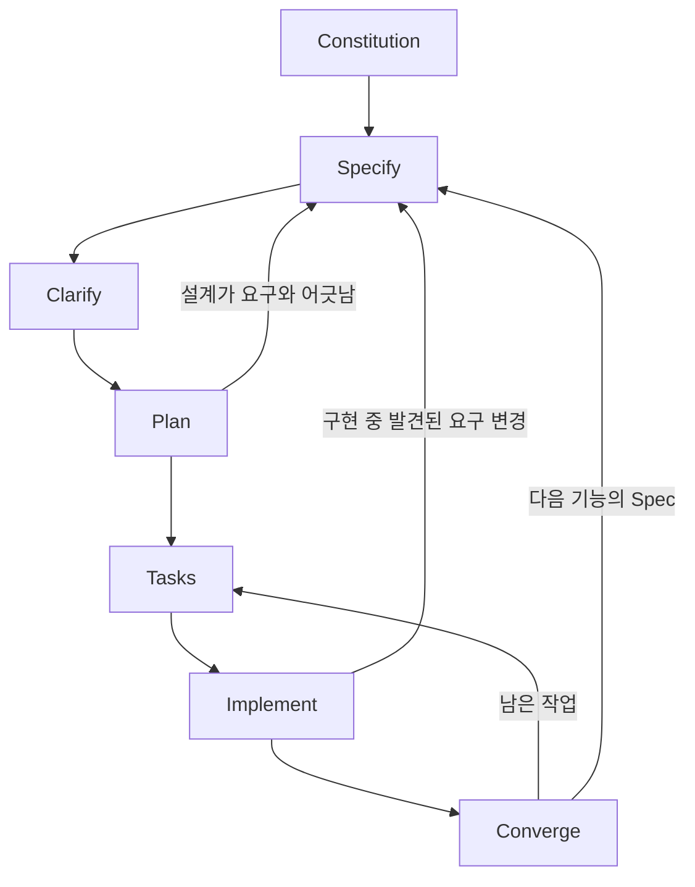

# 사용자 관리 PoC

SI/SM 환경에서 Spec-Driven Development(SDD)를 적용할 수 있는지 검증하는 프로젝트다. 사용자 관리 기능은 그 검증을 위한 대상이다.

## 목표

이 PoC의 목적은 화면을 빨리 만드는 것이 아니다. 요구, Spec, 설계, 구현, 테스트가 한 줄로 연결되는지 확인하는 것이다.

- 기능은 Spec이 작성된 뒤에만 구현한다. Spec에 없는 동작은 넣지 않는다.
- 요구가 바뀌면 코드보다 Spec을 먼저 고친다.
- 구현과 테스트는 대응하는 Spec 항목을 가리킨다. 연결되지 않은 구현이나 테스트는 완료로 보지 않는다.
- 기능 단위 산출물을 남겨, 이후 변경 영향과 검증 범위를 다시 찾을 수 있게 한다.

기준 문서는 [`.specify/memory/constitution.md`](.specify/memory/constitution.md)다.

## SDD 프로세스

앞으로 가는 순서는 Specify, Clarify, Plan, Tasks, Implement, Converge다. Clarify는 Spec에 답을 적은 뒤 Plan으로 간다. 요구가 비거나, 구현 중에 빠지거나, 기능이 끝나면 Specify로 돌아온 뒤 다시 Clarify를 거쳐 Plan으로 간다. Constitution은 사이클 밖에 있고, 기능이 바뀌어도 기준으로 남는다.



| 단계 | 하는 일 | 남기는 산출물 |
| --- | --- | --- |
| Constitution | 프로젝트 원칙을 고정한다. 기능 Spec보다 우선한다. | `.specify/memory/constitution.md` |
| Specify | 사용자 시나리오, 기능 요구, 성공 기준을 적는다. 구현 기술은 적지 않는다. | `specs/NNN-*/spec.md` |
| Clarify | 스펙에서 해석이 갈리는 지점만 질문하고, 답을 스펙에 다시 적는다. | `spec.md`의 Clarifications |
| Plan | 기술 선택, 구조, 데이터, 계약을 설계한다. | `plan.md`, `research.md`, `data-model.md`, `contracts/` |
| Tasks | 설계를 의존 순서 있는 작업으로 나눈다. 테스트 작업이 구현 작업보다 앞선다. | `tasks.md` |
| Implement | `tasks.md` 순서대로 구현한다. 해당 테스트가 통과해야 작업을 마친다. | 코드, 테스트 |
| Converge | 코드가 스펙·계획·작업과 맞는지 보고, 남은 작업만 `tasks.md`에 추가한다. | 필요 시 `tasks.md` |

품질 확인도 앞으로만 가지 않는다.

- Checklist는 요구 문장이 검토 가능한지 본다. 부족하면 Specify로 돌아간다. 구현 완료 표시가 아니다.
- Analyze는 `spec.md`, `plan.md`, `tasks.md`의 불일치를 본다. 고칠 곳은 코드가 아니라 해당 문서다.

완료는 Spec 항목과 구현과 테스트가 연결되고, 관련 테스트가 통과한 상태다.

## 이번 PoC에서 반복한 방식

처음부터 완전한 Spec 하나를 만들지 않았다. 기능이 안정된 뒤 다음 범위를 별도 Spec으로 추가했다. 뒤 스펙은 앞 스펙의 검증, 권한, 상태, 저장 결과를 바꾸지 않는다.

| 순서 | Spec | 범위 |
| --- | --- | --- |
| 1 | [`specs/001-user-management`](specs/001-user-management/spec.md) | 회원가입, 로그인, 내 정보, 비밀번호, 탈퇴, 관리자 목록·검색·상세, 상태와 권한 |
| 2 | [`specs/002-screen-display-rules`](specs/002-screen-display-rules/spec.md) | 로그인, 회원가입, 내 정보, 관리자 목록·상세의 배치와 표시 |
| 3 | [`specs/003-alert-confirm-dialogs`](specs/003-alert-confirm-dialogs/spec.md) | 탈퇴·상태·권한 변경 전의 확인 창, 성공 후의 알림 창 |

사이클을 도식으로 정리한 문서는 [`docs/sdd-development-cycle.md`](docs/sdd-development-cycle.md)다.

## 산출물 위치

```text
.specify/memory/constitution.md   프로젝트 원칙
specs/NNN-기능명/
  spec.md                         요구와 성공 기준
  plan.md                         설계
  tasks.md                        작업
  contracts/                      동작 계약
  checklists/                     요구 품질 점검
src/main/                         구현
src/test/                         Spec 항목을 가리키는 테스트
```

테스트 이름은 검증하는 요구 번호를 포함한다. 예: `fr001_...`, `s002Fr001_...`, `s003Fr001_...`.

## 실행

Java 21, Spring Boot, 서버 렌더링 화면이다. 테스트는 H2 인메모리를 쓴다.

```bash
mvn test
mvn spring-boot:run
```

애플리케이션은 `http://localhost:8080` 이다. 최초 관리자 비밀번호는 환경 변수 `ADMIN_INITIAL_PASSWORD`로만 넣고, 저장소에는 적지 않는다.
