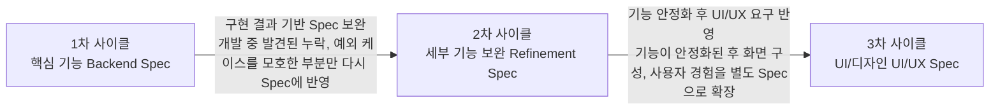

# 실제 진행한 SDD 개발 사이클 (반복형)

핵심 기능부터 세부 보완, UI/디자인까지 반복적으로 Spec을 확장하는 흐름

각 사이클은 Specify, Plan, Develop, Verify 순서로 진행한다.

## 1차 사이클: 핵심 기능 (Backend Spec)

기본 사용자 관리 기능 정의 및 구현

| 단계 | 내용 |
| --- | --- |
| Specify | 핵심 기능 정리, 사용자 시나리오, FR/AC 작성, tasks.md, 데이터 모델 초안 |
| Plan | 기술 스택, 아키텍처 설계, 데이터 모델, 테스트 전략 |
| Develop | 구현, 단위 테스트, 기능별 반복 개발 |
| Verify | 시나리오 테스트, FR 추적성 확인, 성공 기준 측정 |

### 주요 산출물

- spec.md (핵심 기능)
- plan.md
- tasks.md
- 데이터 모델

### 포함 기능 예시

- 회원가입/로그인/로그아웃
- 내 정보 조회/수정
- 비밀번호 변경
- 회원탈퇴(Soft Delete)
- 관리자 목록/검색/상세
- 사용자 상태/권한 관리

### 포함 내용 예시

- API/도메인 설계
- 테스트 케이스
- 구현 코드
- 검증 결과

## 2차 사이클: 세부 기능 보완 (Refinement Spec)

구현/검증 중 발견된 누락·예외·세부 요구사항 보완

| 단계 | 내용 |
| --- | --- |
| Specify | 누락 기능 추가, 예외 케이스 정의, 요구사항 보완, FR/AC 보강 |
| Plan | 변경 영향 분석, 설계 보완, 작업 목록 갱신, 테스트 추가 |
| Develop | 추가 구현, 기존 기능 수정, 회귀 테스트 작성 |
| Verify | 신규 시나리오, 상세 확인 목록, 회귀 테스트 수행, FR/AC 정합성 확인 |

### 주요 산출물

- spec.md (보완)
- plan.md (보완)
- tasks.md (보완)
- 변경 이력

### 추가된 내용 예시

- 검색 조건 및 정렬/페이징
- 마지막 ADMIN 보호 규칙
- 로그인 실패 처리 정책
- 요청 처리 예외 메시지
- 중복/동시 처리 케이스
- 보안/권한 경계 테스트

## 3차 사이클: UI/디자인 (UI/UX Spec)

화면 구성, 사용자 경험, 시연 흐름 정의

| 단계 | 내용 |
| --- | --- |
| Specify | 화면 구조 정의, 사용자 흐름, 입력 및 오류 표시, 화면별 AC 작성 |
| Plan | 화면 구조 설계, 상세 화면 목록, 화면 상태 설계, 테스트 전략 |
| Develop | UI 구현, 마이크로 인터랙션, 화면별 테스트 |
| Verify | UI 시나리오 테스트, 기능 연동 확인, 사용자 흐름 검증 |

### 주요 산출물

- spec.md (UI/UX)
- plan.md (UI)
- 화면 설계서
- 화면별 테스트 케이스

### 포함 내용 예시

- 로그인/회원가입 화면
- 마이페이지 화면
- 관리자 목록/상세 화면
- 검색/필터/페이징 UI
- 상태/권한 변경 화면
- 오류/알림/확인 메시지

## 전체 산출물 구조 (Spec 간 관계)

| 산출물 | 역할 |
| --- | --- |
| Constitution | 프로젝트 원칙. 모든 사이클의 기준. 변경 시 전체에 영향 |
| Spec #1 (핵심 기능) | 사용자 관리 기본 기능. FR-001~. 백엔드 범위 |
| Spec #2 (세부 보완) | 누락/예외 케이스 추가. 기존 FR 보완. 변경 이력 관리 |
| Spec #3 (UI/UX) | 화면 구성 및 사용자 경험. 화면별 AC. 기능 연동 검증 |
| 최종 통합 산출물 | 모든 Spec 반영. 구현 코드. 테스트 결과. 문서화 패키지 |

## SI/SM에서 문서화의 핵심 가치

1. **요구사항의 합의 기준.** 모호한 요구를 구체화하여 발주자–개발자 간 오해를 줄인다.
2. **변경 요청 대응.** 요구 변경을 Spec 변경으로 관리하여 영향 범위를 명확히 파악한다.
3. **추적성과 감사 대응.** 요구, 설계, 구현, 테스트의 연결로 감리/감사 대응이 쉽다.
4. **유지보수(SM) 효율화.** 기능 단위 문서로 운영·장애 시 빠른 원인 파악과 수정이 가능하다.

## SDD 기반 문서화가 특히 효과적인 이유

- AI와 함께 일관된 형식으로 문서 생성이 가능하다.
- 요구사항, 설계, 코드, 테스트가 자동으로 연결되는 구조를 만들 수 있다.
- 기능 추가/변경 시에도 기존 문서의 추적성을 유지하면서 빠르게 확장이 가능하다.
- SI/SM에서 필요한 산출물(요구사항 정의서, 기능명세서, 설계서, 테스트케이스, 변경이력)을 구조화된 형태로 관리할 수 있다.

## 실무 적용 시 유의사항

- 처음부터 완벽한 Spec을 만들기보다는 반복적으로 확장하는 방식을 권장한다.
- Spec은 실제 코드와 동기화되도록 지속적으로 갱신한다.
- 화면(디자인) Spec은 기능 Spec을 대체하지 않고, 별도 레이어로 관리한다.
- SM 단계에서 변경 이력과 영향을 빠르게 찾을 수 있도록 문서 구조를 유지한다.
- 형식보다 일관성과 추적 가능성이 더 중요하다.
